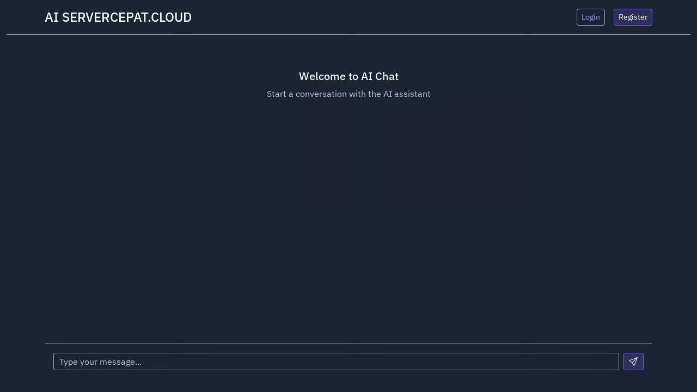
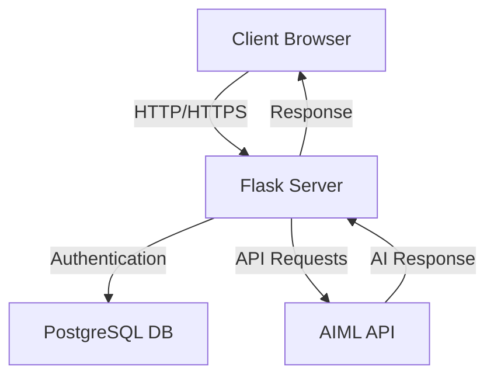

# AI SERVERCEPAT.CLOUD




Aplikasi chat berbasis web yang menggunakan Flask dan AIML API untuk membuat antarmuka chatbot yang mirip dengan GPT. Aplikasi ini menyediakan antarmuka yang user-friendly untuk berinteraksi dengan AI.

## Fitur

- 💬 Chat interface yang responsif dan modern
- 🌙 Dark mode theme yang nyaman di mata
- ⚡ Real-time chat dengan AI
- 🔄 Loading indicators untuk feedback visual
- 📱 Responsive design untuk desktop dan mobile
- 🔐 Sistem autentikasi pengguna

## Screenshot

<div align="center">
  
  
</div>

## Teknologi yang Digunakan

- **Backend**: Python Flask
- **Frontend**: HTML, CSS, JavaScript
- **UI Framework**: Bootstrap
- **API**: AIML API untuk pemrosesan chat
- **Styling**: Custom CSS dengan Bootstrap dark theme
- **Database**: PostgreSQL

## Arsitektur Sistem



## Cara Menjalankan Aplikasi

1. Pastikan Python 3.11+ sudah terinstall
2. Install dependencies yang diperlukan:
   ```bash
   pip install flask requests python-dotenv gunicorn flask-login flask-sqlalchemy psycopg2-binary
   ```

3. Setup environment variables dalam file `.env`:
   ```
   AIML_API_KEY=your_api_key_here
   SESSION_SECRET=your_session_secret
   DATABASE_URL=your_database_url
   ```

4. Jalankan aplikasi:
   ```bash
   python main.py
   ```

5. Buka browser dan akses `http://localhost:5000`

## Environment Variables

- `AIML_API_KEY`: API key dari AIML API (Required)
- `SESSION_SECRET`: Secret key untuk Flask session (Required)
- `DATABASE_URL`: PostgreSQL database URL (Required)

## Struktur Proyek

```
.
├── models/
│   └── user.py
├── routes/
│   └── auth.py
├── static/
│   ├── css/
│   │   └── style.css
│   └── js/
│       └── chat.js
├── templates/
│   ├── auth/
│   │   ├── login.html
│   │   └── register.html
│   └── index.html
├── app.py
├── main.py
└── README.md
```

## Fitur yang Akan Datang

- [x] Sistem autentikasi pengguna
- [ ] Riwayat chat
- [ ] Penyimpanan percakapan
- [ ] Kustomisasi model AI

## Kontribusi

Silakan berkontribusi dengan membuat issue atau pull request jika ingin menambahkan fitur atau memperbaiki bug.

## Lisensi

MIT License habizinnia@gmail.com

## Author

[](https://servercepat.cloud)